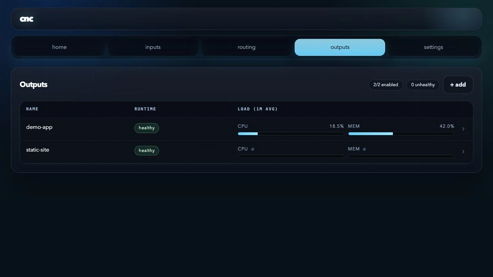
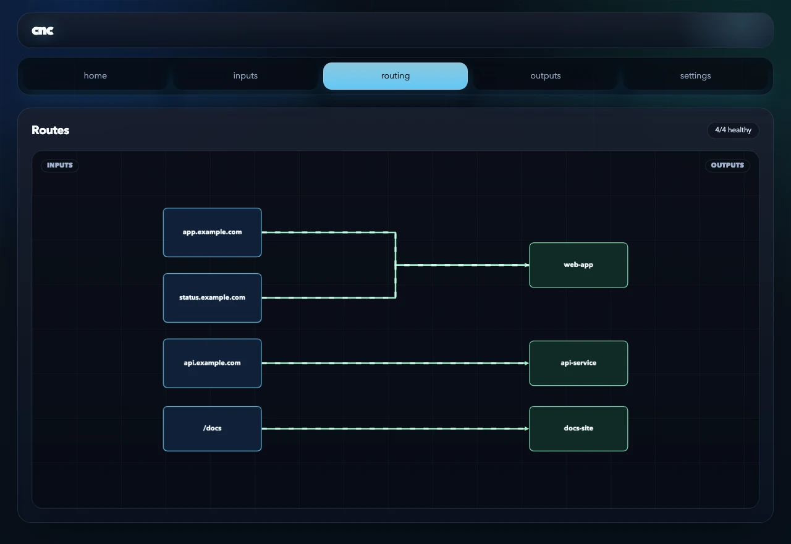
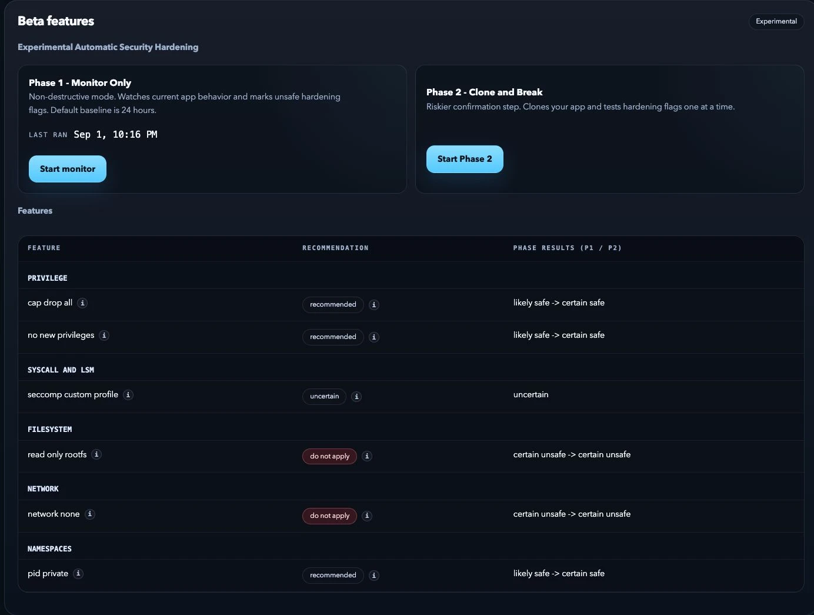

# CNC

**One VPS. Many hosted projects. Explicit security boundaries, minimal attack surface.**

Bring a fresh Ubuntu VPS, Tailscale, and Cloudflare. CNC turns it into a home for many hosted projects. Define your inputs (domains or tailnet routes) and outputs (web apps or static sites). Each app gets its own container, is blocked off from other apps, and can behave like it's on a normal Ubuntu server. The admin interface is available only over Tailscale (or SSH), and app traffic only over Cloudflare.

> [!CAUTION]
> CNC is provided as-is and intended for a fresh Ubuntu VPS.





## Features

### Hosting

- **Inputs** from domains, private Tailscale paths, and Tailscale MagicDNS hostnames.
- **Managed app containers** with dedicated filesystems, health checks, logs, and diagnostics. Podman + Quadlet under the hood. 
- **Static site outputs** for serving host directories alongside app containers.
- **App SSH access** `ssh <output>@<host>` drops you off inside the app's container, just like a regular server

### Security 

- **Cloudflare gated ingress and tailnet gated administration by default.** nginx and UFW restrict public HTTP/S to Cloudflare CIDRs, while the admin interface stays on loopback 
- **Safe host convergence** that validates your set configuration before applying
- **Shield (beta)** puts a lean password protecton page in front of any output with just a toggle
- **Automated container hardening (beta)** observes your app, determines what can be safely locked down, and then applies the changes with your approval. Reccomends Podman flags (Linux capabilities, privledge escalation, seccomp, namespaces, and more). Reccomendations are determined through a mix of runtime profiling and enforcement testing on a disposable clone of the app. 

### Operation and Recovery

- **Automatic resource sizing** that sizes app CPU and memory from the current host and app mix.
- **Backups, restore, and clone workflows** 

## How CNC Works (Architecture)

CNC uses three core concepts:

```text
Input ── routing ──▶ Output
```

**Inputs** declare where traffic enters CNC:

- **Domain**: a public hostname routed through nginx.
- **Tailnet path**: a private Tailscale Serve path.
- **Tailnet service**: a private Tailscale Service hostname.


**Outputs** declare what can receive traffic:

- **App**: a managed app container.
- **Static**: a host filesystem directory served as a website.

**Routing** connects inputs to outputs. Only routes inputs to their expliciltly declared outputs. 

## Security Baselining

CNC’s hardening works in 3 phases. 

1. **Monitor only** observes the existing app without changing its container behavior.
CNC watches the real running app for 24 hours by default.
It gathers evidence such as:
- Logs and Podman events
- Memory, process, CPU, network, and disk activity
- File descriptor counts
- Listening ports and /dev/shm usage

From this, CNC marks each potential restriction as likely safe / likely unsafe / certain unsafe / uncertain. For example, if the app writes into its root filesystem, CNC knows that making the root filesystem read-only would break the app.

2. **Clone and break** tests stricter Podman controls one at a time on a temporary, isolated clone.
The clone is detached from all inputs, assigned an internal port, and placed on a temporary network.

CNC then tests 40+ security controls individually, including:
- Dropping Linux capabilities
- Blocking privilege escalation
- Read-only filesystems and mounts
- Private PID, IPC, cgroup, and namespaces
- Seccomp, AppArmor, SELinux, devices, sysctls, and environment inheritance

For each test, CNC:
1. Recreates the clone with the stricter setting applied.
2. Watches its health, state, logs, and runtime errors.
3. Labels the setting certain safe / certain unsafe / uncertain.

3. **Review** presents recommended, do-not-apply, and uncertain results with the evidence behind each decision.



## Install

CNC expects a fresh Ubuntu VPS.

### Recommended Setup

- Ubuntu 24.04 LTS
- root or sudo access
- a Tailscale tailnet
- a Cloudflare managed domains

### Run The Installer

```bash
sudo git clone https://github.com/Dinkum/cnc.git /opt/cnc
cd /opt/cnc
sudo ./init.sh
```

Press Enter to accept the recommended setup defaults. 

The installer configures the admin interface, firewalls, web servers, CLI tools, and other components. 

> [!IMPORTANT]
> Save the admin access key when it appears. CNC displays it only once.

### Open CNC

Use the private Tailscale HTTPS URL printed at the end of installation.

If Tailscale is unavailable, open a tunnel from your computer:

```bash
ssh -L 9090:127.0.0.1:9090 root@your-vps
```

Then visit:

```text
http://127.0.0.1:9090
```

Unlock CNC with the admin access key printed during installation.

## Host Your First Project

1. Unlock CNC with the admin access key printed during installation.
2. Open **Outputs** and create an **App** output. Give it a name and keep the automatic defaults for your first project.
3. Open the new output and copy its backend SSH command.
4. Enter the project’s Ubuntu environment and deploy your app:

   ```bash
   ssh <output>@<host>
   ```

5. Open **Inputs** and add a public domain, private tailnet path, or Tailscale service name.
6. Attach the input to your output and save.

## Operate CNC

### Host

```bash
# Show recent CNC admin service logs.
cnc-admin logs admin

# Re-apply saved CNC state to the host.
cnc-admin host apply

# Reconcile generated host assets and runtime drift.
cnc-admin host reconcile

# Print a brief to give to your LLM agent. 
llm-help
```

### Projects

```bash
# Enter a project environment.
ssh <output>@<host>

# Diagnose a project.
cnc-admin app doctor <output>

# Show project logs.
cnc-admin app logs <output>

# Run the project repair flow.
cnc-admin fix <output>

# Print a project level support brief.
llm-help <output>
ssh <output>@<host> llm-help
```

Project shells include a standard debug toolbelt such as `curl`, `jq`, `rg`, `sqlite3`, `dig`, `ip`, `ss`, `sudo`, and `wget`.

## Troubleshooting

```bash
sudo systemctl status cnc-admin --no-pager
sudo journalctl -u cnc-admin -n 80 --no-pager
```

## Updates

To update:

```bash
sudo /var/lib/cnc/current/scripts/update_from_github.sh
```

## Advanced Installation

Set a GitHub token for updates:

```bash
sudo GITHUB_READONLY_PAT=github_pat_... ./init.sh
```

Installer overrides for unusual environments:

```bash
# Override SSH port detection.
CNC_SSH_PORTS=22,2222 sudo ./init.sh

# Skip firewall setup for console-only recovery.
CNC_SKIP_FIREWALL=1 sudo ./init.sh
```

## License

MIT. See [LICENSE](LICENSE).
